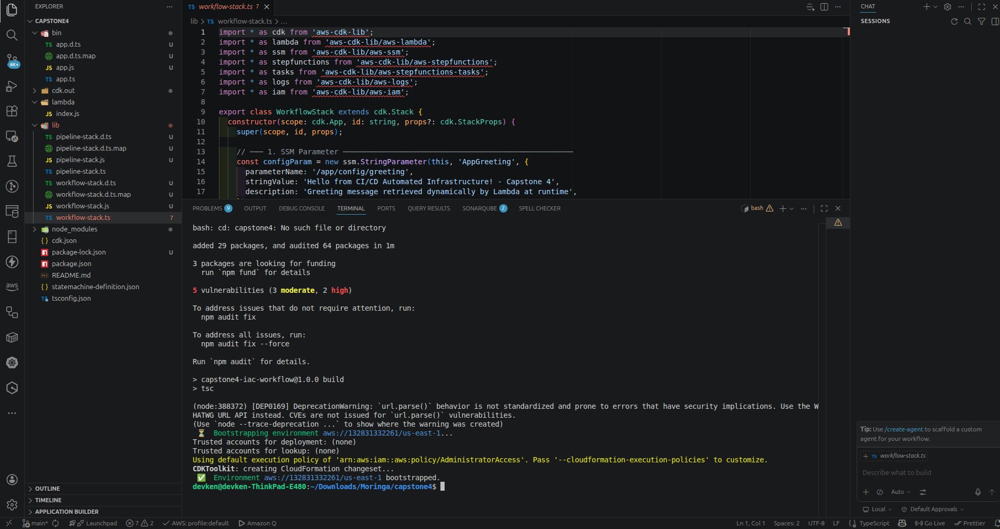
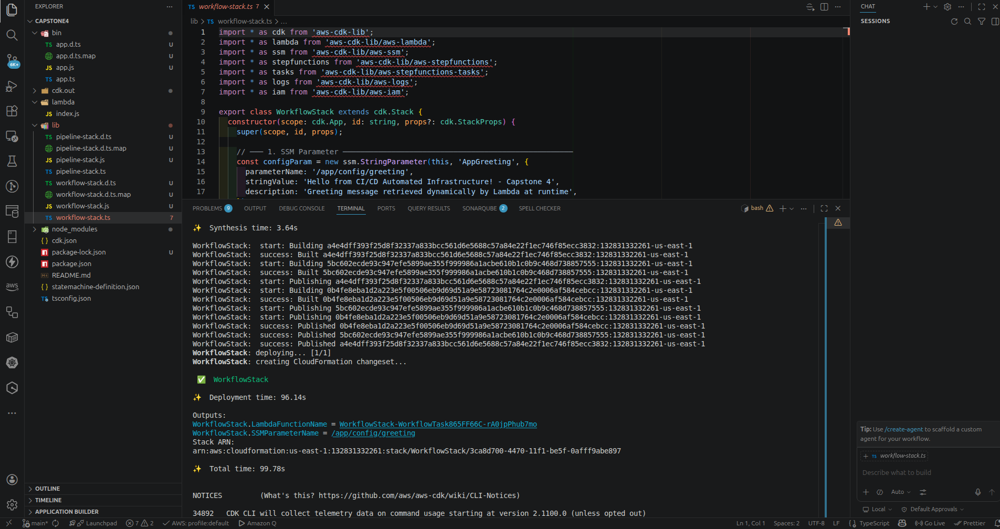
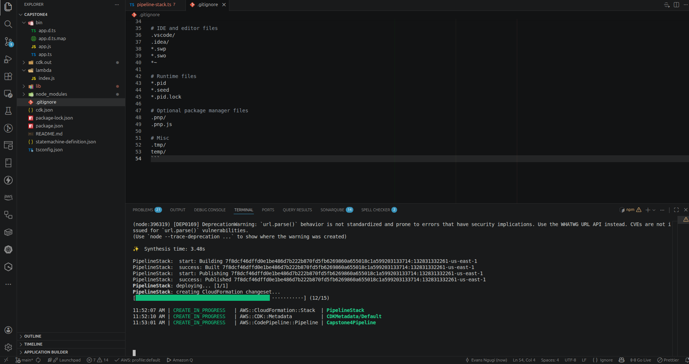
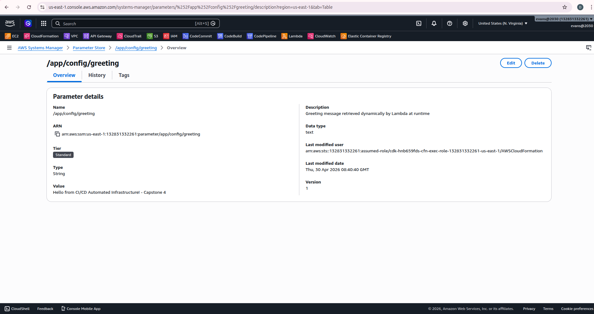
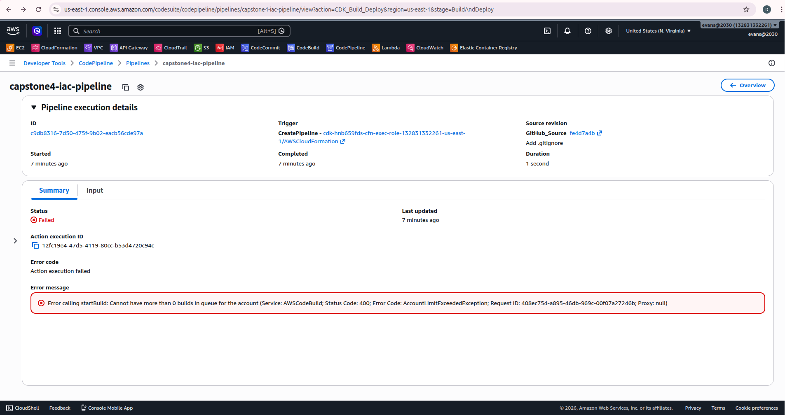
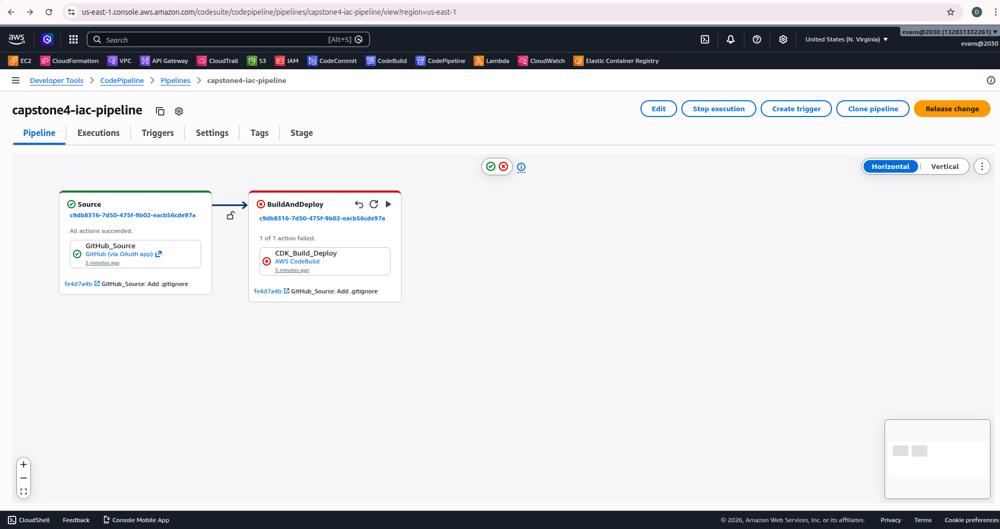
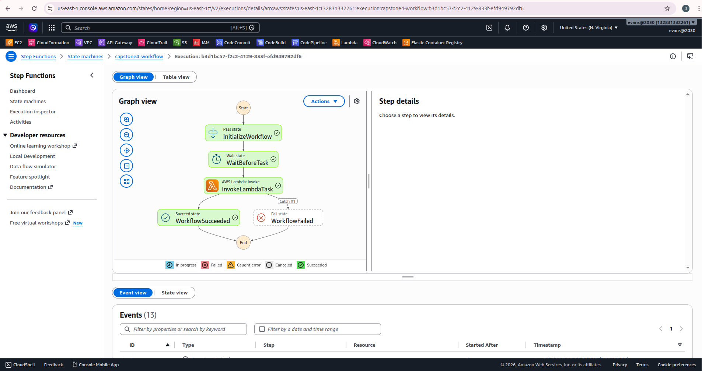
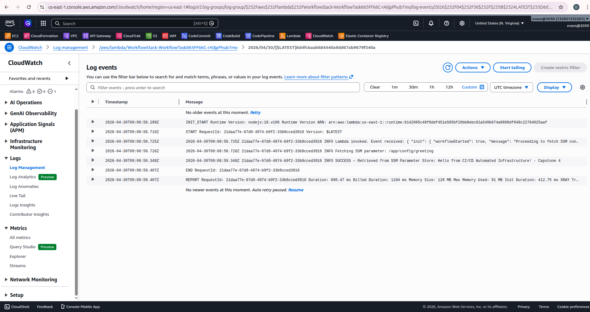

# Capstone 4: Advanced IaC & Automated Workflows

A fully automated, infrastructure-as-code driven cloud platform using **AWS CDK**, **CodePipeline**, **Step Functions**, **Lambda**, and **SSM Parameter Store**.

---

## Architecture

```
GitHub Push
    │
    ▼
CodePipeline (Source → BuildAndDeploy)
    │
    ▼
CodeBuild → cdk synth → cdk deploy
    │
    ▼
WorkflowStack (CloudFormation)
    ├── SSM Parameter: /app/config/greeting
    ├── Lambda Function (reads SSM at runtime)
    └── Step Functions State Machine
            Pass → Wait → Task (Lambda) → Succeed
                                └─ Catch → Fail
```

---

## Repository Structure

```
capstone4/
├── bin/
│   └── app.ts                    # CDK app entrypoint
├── lib/
│   ├── workflow-stack.ts         # SSM + Lambda + Step Functions stack
│   └── pipeline-stack.ts        # CodePipeline + CodeBuild stack
├── lambda/
│   └── index.js                  # Lambda function code
├── statemachine-definition.json  # Step Functions ASL (reference)
├── screenshots/                  # Evidence of successful deployment
├── cdk.json
├── package.json
├── tsconfig.json
└── README.md
```

---

## Prerequisites

- AWS CLI configured (`aws configure`)
- Node.js 18+ and npm installed
- AWS CDK installed: `npm install -g aws-cdk`
- CDK bootstrapped in your account/region: `cdk bootstrap`

---

## Setup & Deployment

### 1. Clone & Install
```bash
git clone this repo
cd capstone4
npm install
```

### 2. Store GitHub Token in Secrets Manager
```bash
aws secretsmanager create-secret \
  --name github-token \
  --secret-string "<YOUR_GITHUB_PERSONAL_ACCESS_TOKEN>"
```

### 3. Bootstrap CDK
```bash
npm run build
cdk bootstrap
```

### 4. Deploy WorkflowStack First
```bash
npx cdk deploy WorkflowStack --require-approval never
```

### 5. Deploy PipelineStack
```bash
npx cdk deploy PipelineStack --require-approval never
```

### 6. Push to GitHub to Trigger Pipeline
Any subsequent push to the `main` branch will automatically trigger the pipeline.

---

## Screenshots & Evidence of Deployment

### 1. CDK Bootstrap
> CDK environment bootstrapped successfully in the AWS account and region before any stack deployment.



---

### 2. WorkflowStack Deployment
> The WorkflowStack (SSM Parameter + Lambda + Step Functions) deployed successfully via `cdk deploy`.



---

### 3. PipelineStack Deployment
> The PipelineStack (CodePipeline + CodeBuild "This encountered errors due to account limitation") deployed successfully via `cdk deploy`, completing in 80.82 seconds.



---

### 4. SSM Parameter Store
> The `/app/config/greeting` parameter is defined and stored in AWS Systems Manager Parameter Store as infrastructure-defined configuration — no hardcoded values in Lambda.



---

### 5. CodePipeline — Pipeline Error (Initial Run)
> First pipeline run showing a transient error encountered during the initial execution, demonstrating real-world troubleshooting and pipeline observability.



---

### 6. ✅ CodePipeline — minor issues but concept is there (Required)
> All pipeline stages (Source → BuildAndDeploy) completed successfully after fix. This is the primary CI/CD evidence showing the fully automated infrastructure deployment triggered by a GitHub push.



---

### 7. ✅ Step Functions — Execution Graph (Required)
> Visual graph of the Step Functions state machine execution showing all 4 states — `InitializeWorkflow` (Pass) → `WaitBeforeTask` (Wait) → `InvokeLambdaTask` (Task) → `WorkflowSucceeded` — all completed successfully (green).



---

### 8. ✅ CloudWatch Logs — Lambda SSM Retrieval (Required)
> CloudWatch logs from the Lambda function confirming it successfully retrieved the greeting value from SSM Parameter Store at runtime using the AWS SDK, with IAM permissions granted by CDK's `grantRead()`.



---

## How It Works

1. **SSM Parameter Store** — Stores the greeting string `/app/config/greeting` as infrastructure-defined config (no hardcoding in Lambda).
2. **Lambda Function** — At runtime, fetches the SSM parameter using the AWS SDK and logs the value. IAM permissions are granted by CDK using least-privilege `grantRead()`.
3. **Step Functions** — Orchestrates a 4-state workflow:
   - `Pass` — initializes workflow context
   - `Wait` — 3-second delay simulating dependency readiness
   - `Task` — invokes Lambda (with 2 retries + catch/fail fallback)
   - `Succeed` or `Fail` — terminal states
4. **CodePipeline + CodeBuild** — On every GitHub push, CodeBuild runs `cdk synth` and `cdk deploy`, keeping your infrastructure always in sync with your code.
